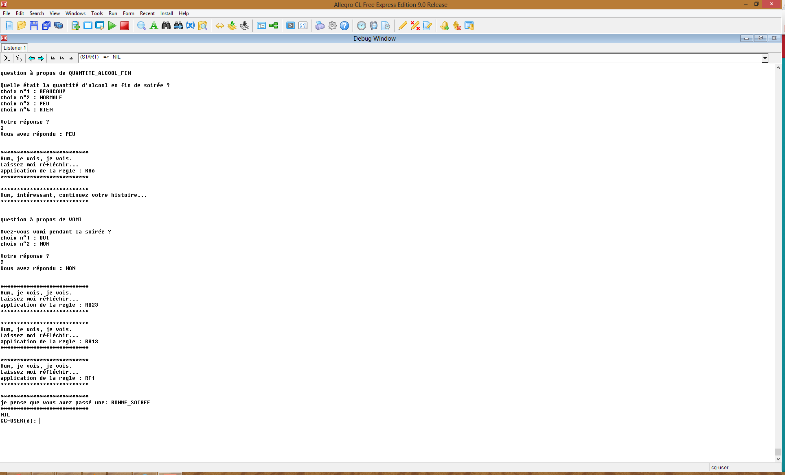

How-was-last-night
==================

How was last night is an expert system written in Lisp that basically helps you decide whether you had a great time during an event or party or not. The result is based on a combination of the user's answers to a certain number of questions.

The system uses an inference engine, itself relying on a process called forward-chaining. Basically, the engine collects data and uses a set of rules to extract more data, until it is able to make a final conclusion.

Although the subject seems quite fun, the implementation was not easy and we spent a fair amount of time on this. How was last night was developed as the final project of an Artifical intelligence class.

Usage
=====

In order to be able to use the expert system, you need to open a Lisp prompt command and type the following:

    (load "core.lisp") ;;; To load our core code
    (start) ;;; To start the engine
    
Then you just need to answer the questions by typing the answer number and press Enter (beware that the questions are in
French only).

You should get something like this

telling me that I indeed had a great time the other night. Hurra!
